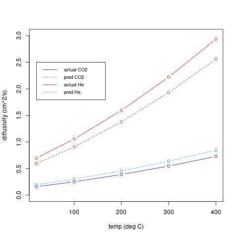

# predict_diffusion_constant
predict diffusion constant at different temperatures for dilute gas molecules in an excess of air

# Prediction methods
- linear least squares using molar mass, kinetic diameter, dipole moment
  - 
- nonlinear least squares
- ML model
