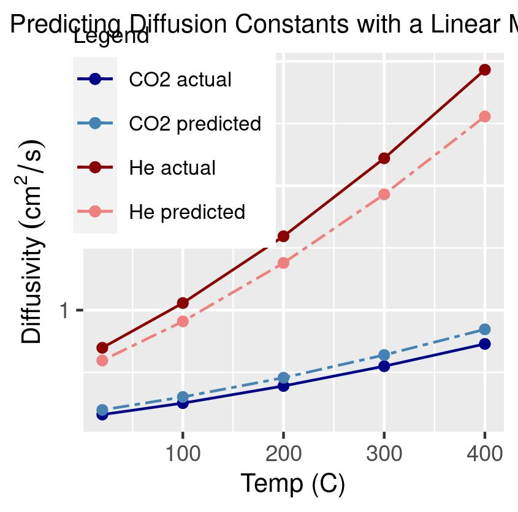

# predict_diffusion_constant
predict diffusion constant at different temperatures for different types of gas in air

# Prediction methods
- Linear least squares model
- See "analysis.R" for details. I created feature vectors for 7 small molecules that I had diffusion constant data for. The feature selection was done manually. Then I solved for the coefficient matrix using 5 of the molecules and tested it (see image below) on the 2 remaining molecules.
  - feature vectors: 1 / (molar mass)^0.5, kinetic diameter, dipole moment
  - 

# Summary
- This model has the strength of being easy to interpet. Increasing the molar mass decreases the diffusion constant. Increasing the kinetic diameter or the dipole moment decreases the diffusion constant.
- One interesting result is that the model predicts the diffusion limit for a gas at each temperature in the study, obtained by plugging the (MM = 1, KDiam = 0, Dipole = 0) feature vector into the model.
