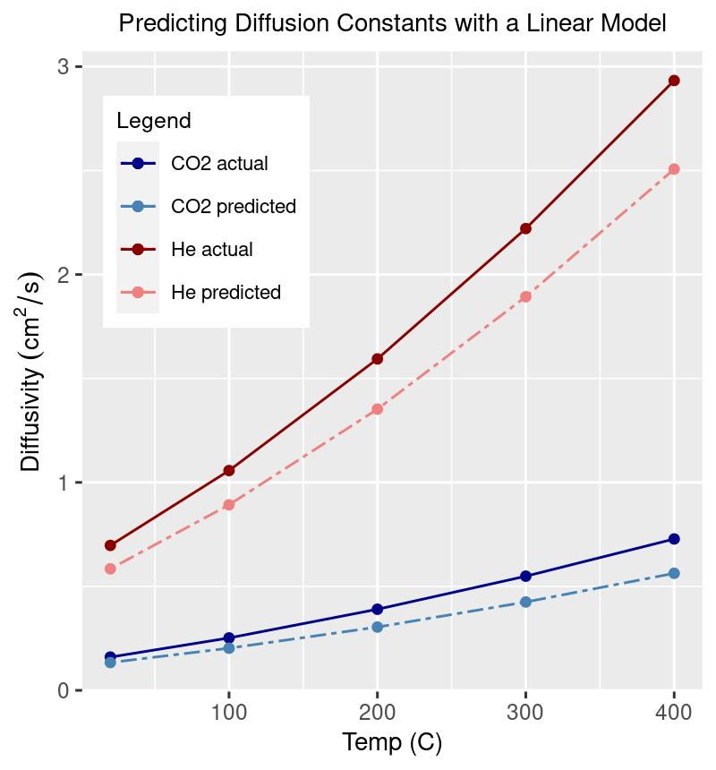

# Overview
Predict diffusion constants at different temperatures for various types gases in air

# Prediction methods
- Linear least squares model
- See "analysis.R" for details. 
- Feature vector data was assembled for 7 small molecules with known diffusion constants at 5 different temperatures
- The model (coefficient) matrix was solved using 5 of the molecules and tested against the 2 remaining molecules (CO2 and He).

# Feature Selection
- The feature selection was done manually 
- Features: 1 / (molar mass)^0.5, 1/(molecular volume)^1/3, dipole moment

# Summary
- 
## Pros of method
- This model has the strength of being easy to interpet using the coefficients of the model terms. 
  - E.g. The (1/sqrt(MM)) feature increases when the MM gets smaller, and the diffusion constant increases, and all the (1/sqrt(MM)) coefficients are positive. I.e. The diffusion constant "goes as" the 1/sqrt(MM) term and thus has a positive sign in the model
  - The same logic holds for the Volume term, 1/ ( Vol^(1/3) ). The diffusion constant varies in the same direction as this term, so its model coefficients are postiive.
  - All the dipole moment coefficients are negative, indicating that when all other factors are equal, a higher dipole moment with result in a lower diffusion constant. This makes sense from a molecular interaction standpoint, since molecules with stronger interaction forces with their neighbors will move more slowly through a medium. 

- One interesting result is that the model predicts the diffusion limit for a gas at each temperature in the study, obtained by plugging the (MM = 1, KDiam = 0, Dipole = 0) feature vector into the model.
